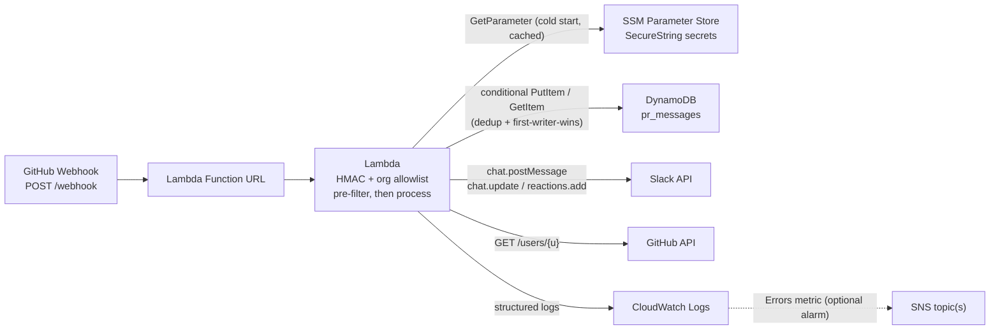
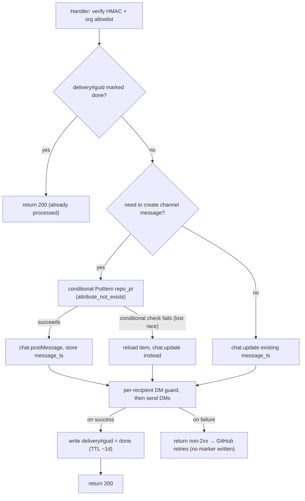

# ReviewBell — `terraform-aws-reviewbell`

## Repo naming

| What | Name |
|---|---|
| **GitHub repo** | `terraform-aws-reviewbell` |
| **Terraform Registry** | `edgarpf/reviewbell/aws` |

Follows the HashiCorp convention for module-only repos: `terraform-<provider>-<name>`.

## Repo layout (module-only)

```
terraform-aws-reviewbell/
├── lambda/
│   └── handler.zip          # pre-built Node.js 24 bundle
├── main.tf
├── variables.tf
├── outputs.tf
├── versions.tf
├── iam.tf
├── ssm.tf
├── dynamodb.tf
├── examples/
│   └── basic/
├── .github/workflows/
│   ├── ci.yml
│   └── release.yml
├── LICENSE
└── README.md
```

Lambda source code lives in the same repo under `src/` (built into `lambda/handler.zip` by CI) — or can be colocated at repo root. No separate app repo required.

## What the module provisions

- **Lambda function** (Node.js 24) — invoked by the Function URL; verifies HMAC + org allowlist, then processes the event (DynamoDB reads/writes, Slack/GitHub API calls). Optional `reserved_concurrent_executions` caps blast radius / cost from unauthenticated floods.
- **Lambda Function URL** — public HTTPS endpoint for GitHub webhooks, no API Gateway needed
- **SSM Parameter Store `SecureString` parameters** — hold the sensitive config (GitHub webhook secrets/tokens, Slack bot tokens), KMS-encrypted, IAM-scoped, CloudTrail-audited; fetched by the Lambda at cold start and cached
- **DynamoDB `pr_messages` table** — stores per-PR routes + `message_ts` for in-place updates, short-lived `delivery#<guid>` dedup items for webhook-retry idempotency, and caches `github_username → slack_user_id` (via a `user#` key prefix); TTL auto-expires all three
- **IAM role** — least-privilege Lambda execution role (basic logging + DynamoDB read/write on the table + `ssm:GetParameter(s)` scoped to the module's parameter prefix)
- **CloudWatch log group** — explicit `/aws/lambda/<name>` group with configurable retention (`log_retention_days`, default 90) and encryption at rest (`log_kms_key_arn`, defaulting to the AWS-managed key). Created by the module rather than auto-created by Lambda so retention and encryption are controlled. The handler writes structured JSON, metadata only.
- **CloudWatch alarm (optional)** — created only when `alarm_sns_topic_arns` is set; alarms on the Lambda `Errors` metric and notifies the provided SNS topic(s), so dropped events are visible

No EC2, no Docker, no VPC attachment needed. The Lambda uses a single committed `handler.zip`. Secrets stay out of the function config (in SSM `SecureString`); non-sensitive routing config is passed as Lambda environment variables. Values written by Terraform still live in tfstate (safe with an encrypted S3 backend).

## Architecture



## File layout (following repo conventions)

```
terraform-aws-reviewbell/
├── lambda/
│   └── handler.zip    # pre-compiled Node.js 24 bundle — committed
├── main.tf            # Lambda function + Function URL
├── variables.tf       # All inputs — typed, described, sensitive where needed
├── outputs.tf         # webhook_url, function_name, dynamodb_table_name, log_group_name
├── versions.tf        # required_version >= 1.15.0, aws provider ~> 6.54
├── iam.tf             # Lambda execution role and least-privilege policy (DynamoDB + SSM read)
├── ssm.tf             # SecureString parameters for sensitive config (KMS-encrypted)
├── dynamodb.tf        # pr_messages table with TTL (PR state, dedup items, user cache)
├── observability.tf   # CloudWatch log group (retention + encryption) + optional error alarm → SNS
└── README.md
```

No `archive_file` data source — `handler.zip` is referenced directly via `${path.module}/lambda/handler.zip` with `source_code_hash`.

## Versions and toolchain

Pin to the latest stable releases at implementation time. Values below are current as of July 2026; the implementer should run a fresh `terraform init -upgrade` / `npm install` and commit `.terraform.lock.hcl` and `package-lock.json` so the exact resolved versions are reproducible.

### Terraform + provider (`versions.tf`)

```hcl
terraform {
  required_version = ">= 1.15.0"   # dev/CI pinned to latest stable 1.15.8 (Jul 8, 2026)

  required_providers {
    aws = {
      source  = "hashicorp/aws"
      version = "~> 6.54"           # latest 6.x line; 6.54.0 (Jul 8, 2026)
    }
  }
}
```

A floor `required_version` (not an exact pin) keeps the published module usable by the widest range of consumers, while CI runs the latest stable Terraform. The AWS provider uses `~> 6.54` to accept any newer 6.x without silently jumping to a future breaking 7.0.

### Lambda runtime

- **`nodejs24.x`** — the latest AWS-managed Node.js runtime (Node.js 26 support is not expected until ~Nov 2026), supported with patches until **Apr 30, 2028**. Set via `var.lambda_runtime` so it can be bumped later without a code change. Note: Node.js 24 on Lambda supports only async/await handlers (no callback-style handlers).

### Node.js app dependencies (`package.json`)

Bundled into `handler.zip` via esbuild; install latest and lock in `package-lock.json`.

- **`@slack/web-api`** `^7.19.0` — latest stable (8.0.0 is still an RC as of now, so stay on 7.x)
- **`@octokit/rest`** `^22.0.1` — GitHub REST client (requires Node 20+; fine on Node 24)
- **`@aws-sdk/client-dynamodb`** + **`@aws-sdk/client-ssm`** (+ `@aws-sdk/lib-dynamodb`) — AWS SDK for JavaScript v3, latest v3 release
- **dev**: `typescript` (latest 5.x), `esbuild` (latest), `@types/aws-lambda`, `@types/node` (v24 to match the runtime)

Prefer the AWS SDK v3 modular clients over the runtime-bundled SDK so the version is explicit and reproducible rather than tied to whatever minor the runtime happens to ship.

## Variable sections (`variables.tf`)

```hcl
# ── General ──────────────────────────────────────────────────────────────────────

variable "name" {
  description = "Name prefix applied to all resource names and tags."
  type        = string
}

# ── GitHub orgs ───────────────────────────────────────────────────────────────────

variable "github_orgs" {
  description = "Map of GitHub organisation names to their credentials. Keys must be the exact GitHub organisation login (e.g. 'acme-corp') — they are used as an allowlist: any webhook payload whose repository.owner.login is not a key here is rejected with 403, even if the HMAC signature is valid. The webhook_secret verifies payload authenticity; the token is used for GitHub API calls. Token requires read:user and repo scopes."
  type = map(object({
    webhook_secret = string
    token          = string
  }))
  sensitive = true

  # Example — keys are the actual GitHub org names:
  # {
  #   "acme-corp"   = { webhook_secret = "s3cr3t-acme",    token = "ghp_acme..."    }
  #   "widgets-inc" = { webhook_secret = "s3cr3t-widgets", token = "ghp_widgets..." }
  # }
}

variable "default_github_org" {
  description = "Key from github_orgs (i.e. a GitHub org name) used when a mapping rule does not specify a github_org. Required when github_orgs has more than one entry and any mapping rule omits github_org."
  type        = string
  default     = null
}

variable "github_api_base_url" {
  description = "Base URL for GitHub REST API calls. Leave null for github.com (https://api.github.com). Set to your GitHub Enterprise Server API endpoint (e.g. https://github.example.com/api/v3) when running against GHES."
  type        = string
  default     = null
}

# ── Slack workspaces ──────────────────────────────────────────────────────────────

variable "slack_workspaces" {
  description = "Map of workspace labels to Slack credentials and optional workspace-level emoji overrides. Each key is an arbitrary identifier referenced in mappings and default_mapping. Bot tokens require chat:write, im:write, reactions:write, users:read.email (for GitHub-email -> Slack-user resolution), and channels:read/groups:read (to resolve #channel names to IDs) scopes. The bot must also be invited to every target channel or chat.postMessage will fail. Workspace emojis override global var.emojis defaults — use this for custom workspace-specific emoji names that only exist in that workspace."
  type = map(object({
    bot_token = string
    emojis = optional(object({
      opened            = optional(string)
      approved          = optional(string)
      changes_requested = optional(string)
      merged            = optional(string)
      closed            = optional(string)
      ci_pass           = optional(string)
      ci_fail           = optional(string)
      merged_reaction   = optional(string)
    }))
  }))
  sensitive = true

  # Example:
  # {
  #   eng    = { bot_token = "xoxb-eng-...",    emojis = { merged = "shipit" } }
  #   design = { bot_token = "xoxb-design-...", emojis = { merged = "framed_picture", merged_reaction = "framed_picture" } }
  # }
}

# ── Routing ───────────────────────────────────────────────────────────────────────

variable "mappings" {
  description = "Routing rules keyed by repo. Each entry fans out to one or more Slack workspaces, each delivering to one or more channels. Per-repo behaviour overrides fall back to global defaults when omitted. Match precedence (most specific wins): exact 'org/repo' > org wildcard 'org/*' > global catch-all '*' > default_mapping. Exactly one rule is applied per repo. Repo/org names are matched case-insensitively (GitHub logins are case-insensitive)."
  type = list(object({
    repo       = string  # "org/frontend" exact, "org/*" org-wide, or "*" catch-all

    # Destinations: one repo → many workspaces → optional channels each
    destinations = list(object({
      workspace = string                          # key in slack_workspaces — required for DMs and channel posts
      channels  = optional(list(string), [])    # channel IDs or #names; omit or [] for DM-only in this workspace
    }))

    # Per-repo overrides — all optional, fall back to global defaults
    github_org        = optional(string)       # key in github_orgs; falls back to default_github_org
    muted_users       = optional(list(string), [])  # merged with global muted_users
    personal_dms      = optional(bool)
    author_dms        = optional(bool)
    mention_dms       = optional(bool)
    ignore_bots       = optional(bool)
    ci_notifications  = optional(bool)
    emojis = optional(object({
      opened            = optional(string)
      approved          = optional(string)
      changes_requested = optional(string)
      merged            = optional(string)
      closed            = optional(string)
      ci_pass           = optional(string)
      ci_fail           = optional(string)
      merged_reaction   = optional(string)
    }))
  }))

  # Example:
  # [
  #   {
  #     repo = "org/frontend"
  #     destinations = [
  #       { workspace = "eng", channels = ["#frontend-prs"] }
  #     ]
  #     # uses all global defaults
  #   },
  #   {
  #     repo = "org/platform"
  #     destinations = [
  #       { workspace = "eng",    channels = ["#platform-prs", "#engineering"] },
  #       { workspace = "design", channels = ["#design-review"]                },
  #     ]
  #   },
  #   {
  #     repo = "org/sensitive-api"
  #     destinations = [
  #       { workspace = "eng" }   # DM-only — no channel messages, reviewers still get DMs
  #     ]
  #     personal_dms = true
  #   },
  # ]
}

variable "default_mapping" {
  description = "Fallback routing applied when no mapping entry matches a repo. Supports the same destinations structure and per-repo overrides. If null, unmatched repos are silently dropped."
  type = object({
    destinations = list(object({
      workspace = string
      channels  = optional(list(string), [])
    }))
    github_org        = optional(string)
    muted_users       = optional(list(string), [])
    personal_dms      = optional(bool)
    author_dms        = optional(bool)
    mention_dms       = optional(bool)
    ignore_bots       = optional(bool)
    ci_notifications  = optional(bool)
    emojis = optional(object({
      opened            = optional(string)
      approved          = optional(string)
      changes_requested = optional(string)
      merged            = optional(string)
      closed            = optional(string)
      ci_pass           = optional(string)
      ci_fail           = optional(string)
      merged_reaction   = optional(string)
    }))
  })
  default = null

  # Example:
  # {
  #   destinations = [{ workspace = "eng", channels = ["#engineering"] }]
  # }
}

# ── User mapping ──────────────────────────────────────────────────────────────────

variable "user_map" {
  description = "Explicit map of GitHub username to Slack user ID, checked first in the resolution chain. GitHub hides user email by default, so automatic email-based resolution only works for members who set a public work email matching Slack. In orgs where email is private, this map is the primary resolution mechanism, not a rare exception. Add entries for anyone whose GitHub email is private or differs from their Slack email."
  type        = map(string)
  default     = {}

  # Example: { "contractor-alice" = "U0ABC123", "jdoe" = "U0DEF456" }
}

# ── Lambda ────────────────────────────────────────────────────────────────────────

variable "lambda_runtime" {
  description = "Lambda runtime identifier. Defaults to nodejs24.x (supported until April 2028). Update to a newer runtime when the current one approaches end-of-life."
  type        = string
  default     = "nodejs24.x"
}

variable "lambda_memory_size" {
  description = "Amount of memory in MB allocated to the Lambda function."
  type        = number
  default     = 256
}

variable "lambda_timeout" {
  description = "Maximum execution time in seconds for a single Lambda invocation."
  type        = number
  default     = 30
}

variable "reserved_concurrency" {
  description = "Reserved concurrent executions for the Lambda. Caps blast radius and cost from unauthenticated floods against the public Function URL (requests still fail HMAC, but capping concurrency bounds spend). Set to -1 to leave unreserved (account default)."
  type        = number
  default     = -1
}

# ── Observability ─────────────────────────────────────────────────────────────────

variable "log_retention_days" {
  description = "Retention period (days) for the Lambda's CloudWatch log group. Must be a CloudWatch-supported value (1,3,5,7,14,30,60,90,120,150,180,365,...). Defaults to 90."
  type        = number
  default     = 90
}

variable "log_kms_key_arn" {
  description = "KMS key ARN for encrypting the CloudWatch log group at rest. Leave null (default) to use the AWS-managed CloudWatch Logs key. If you supply a customer-managed key, its key policy must allow the CloudWatch Logs service principal (logs.<region>.amazonaws.com) to use it, scoped with the kms:EncryptionContext:aws:logs:arn condition."
  type        = string
  default     = null
}

variable "alarm_sns_topic_arns" {
  description = "SNS topic ARNs to notify when the Lambda reports errors. When non-empty, the module creates a CloudWatch alarm on the Lambda Errors metric wired to these topics, so events dropped after GitHub exhausts its webhook retries are surfaced. When empty (default) no alarm is created."
  type        = list(string)
  default     = []
}

# ── Behaviour defaults ────────────────────────────────────────────────────────────
# These apply to all mapping rules. Any rule can override individual fields.

variable "muted_users" {
  description = "GitHub usernames that will never receive DMs or @mentions regardless of repo. Combined with any per-repo muted_users — a user in either list is muted for that repo."
  type        = list(string)
  default     = []

  # Example: ["bot-account", "contractor-alice"]
}

variable "personal_dms" {
  description = "Default for whether a Slack DM is sent to each reviewer when assigned. Can be overridden per mapping rule."
  type        = bool
  default     = true
}

variable "author_dms" {
  description = "Default for whether the PR author receives a Slack DM when someone comments on their PR or submits a review with changes requested. Uses one in-place-updated DM per PR (not a new message per comment). Can be overridden per mapping rule."
  type        = bool
  default     = true
}

variable "mention_dms" {
  description = "Default for whether users explicitly @mentioned in a PR comment or review body receive a Slack DM linking to that comment. Keeps re-looping specific people (reviewers, or others) a deliberate, low-noise action. Skips the comment author (no self-DM), muted_users, and GitHub team mentions (e.g. @org/team). Can be overridden per mapping rule."
  type        = bool
  default     = true
}

variable "ignore_bots" {
  description = "Default for whether events whose sender/author is a GitHub App or bot (sender.type == 'Bot', e.g. dependabot, CI apps, review bots) are ignored entirely — no channel messages, no DMs. Prevents automation from flooding channels. Can be overridden per mapping rule."
  type        = bool
  default     = true
}

variable "ci_notifications" {
  description = "Default for whether CI status (from check_suite/status webhook events) is reflected on the channel message badge using the ci_pass/ci_fail emojis. CI events are only used to update an existing channel message in place (debounced to the latest aggregate result); they never create a message or send DMs. Set false to ignore CI entirely. Can be overridden per mapping rule."
  type        = bool
  default     = true
}

variable "emojis" {
  description = "Default Slack emoji codes for each PR state and event. Use any standard or custom workspace emoji name without colons. Can be overridden per mapping rule for individual repos."
  type = object({
    opened            = optional(string, "yellow_circle")
    approved          = optional(string, "white_check_mark")
    changes_requested = optional(string, "red_circle")
    merged            = optional(string, "tada")
    closed            = optional(string, "no_entry_sign")
    ci_pass           = optional(string, "white_check_mark")
    ci_fail           = optional(string, "x")
    merged_reaction   = optional(string, "tada")
  })
  default = {}
}

# ── Tags ──────────────────────────────────────────────────────────────────────────

variable "tags" {
  description = "Additional tags to apply to all resources."
  type        = map(any)
  default     = {}
}
```

## Key resource details

### `main.tf` — Lambda + Function URL

```hcl
resource "aws_lambda_function" "this" {
  function_name                  = var.name
  role                           = aws_iam_role.this.arn
  runtime                        = var.lambda_runtime
  handler                        = "index.handler"
  filename                       = "${path.module}/lambda/handler.zip"
  source_code_hash               = filebase64sha256("${path.module}/lambda/handler.zip")
  timeout                        = var.lambda_timeout
  memory_size                    = var.lambda_memory_size
  reserved_concurrent_executions = var.reserved_concurrency

  # Explicit log group (created in observability.tf) so retention + encryption are controlled.
  logging_config {
    log_format            = "JSON"
    application_log_level = "INFO"
    system_log_level      = "WARN"
    log_group             = aws_cloudwatch_log_group.this.name
  }

  environment {
    variables = {
      PR_TABLE           = aws_dynamodb_table.pr_messages.name

      # Sensitive config lives in SSM — pass only the parameter names
      GITHUB_ORGS_PARAM      = aws_ssm_parameter.github_orgs.name
      SLACK_WORKSPACES_PARAM = aws_ssm_parameter.slack_workspaces.name

      # Non-sensitive routing/behaviour config stays inline
      DEFAULT_GITHUB_ORG  = var.default_github_org
      GITHUB_API_BASE_URL = var.github_api_base_url
      MAPPINGS            = jsonencode(var.mappings)
      DEFAULT_MAPPING     = jsonencode(var.default_mapping)
      USER_MAP            = jsonencode(var.user_map)
      MUTED_USERS         = jsonencode(var.muted_users)
      PERSONAL_DMS        = tostring(var.personal_dms)
      AUTHOR_DMS          = tostring(var.author_dms)
      MENTION_DMS         = tostring(var.mention_dms)
      IGNORE_BOTS         = tostring(var.ignore_bots)
      CI_NOTIFICATIONS    = tostring(var.ci_notifications)
      EMOJIS              = jsonencode(var.emojis)
    }
  }
  tags = merge(var.tags, { Name = var.name })
}

resource "aws_lambda_function_url" "this" {
  function_name      = aws_lambda_function.this.function_name
  authorization_type = "NONE"  # GitHub webhook IPs not fixed; HMAC verified in app code
}
```

The Lambda reads the two SecureString parameter names from env vars and fetches+caches their decrypted values at cold start (via the AWS SDK or the Parameters and Secrets Lambda Extension). Non-sensitive config is read directly from env vars.

### `ssm.tf` — sensitive config in SSM SecureString

```hcl
resource "aws_ssm_parameter" "github_orgs" {
  name  = "/${var.name}/github_orgs"
  type  = "SecureString"                 # KMS-encrypted; uses the aws/ssm key unless key_id is set
  value = jsonencode(var.github_orgs)     # { "<org>" = { webhook_secret, token } }
  tags  = merge(var.tags, { Name = "${var.name}-github-orgs" })
}

resource "aws_ssm_parameter" "slack_workspaces" {
  name  = "/${var.name}/slack_workspaces"
  type  = "SecureString"
  value = jsonencode(var.slack_workspaces) # { "<workspace>" = { bot_token, emojis? } }
  tags  = merge(var.tags, { Name = "${var.name}-slack-workspaces" })
}
```

`SecureString` values are encrypted at rest with KMS and only readable by principals granted `ssm:GetParameter` on these specific ARNs (see `iam.tf`). Standard-tier parameters are free and hold up to 4 KB each — ample for the secrets. The plaintext values are still written to tfstate by Terraform, so an encrypted backend remains the trust boundary. The IAM policy grants the Lambda `ssm:GetParameter`/`GetParameters` on `arn:aws:ssm:*:*:parameter/${var.name}/*` only.

### `dynamodb.tf` — PR state + dedup + user cache (single table)

```hcl
resource "aws_dynamodb_table" "pr_messages" {
  name         = "${var.name}-pr-messages"
  billing_mode = "PAY_PER_REQUEST"
  # Key namespaces by prefix:
  #   "org/frontend#42"  → PR state item (routes, message_ts, reviewers)
  #   "delivery#<guid>"  → webhook-delivery dedup marker (idempotency)
  #   "user#<login>"     → cached github→slack resolution
  hash_key = "repo_pr"

  attribute {
    name = "repo_pr"
    type = "S"
  }
  ttl {
    attribute_name = "expires_at"       # PR items ~30d after close; dedup items ~1d; user mappings refresh periodically
    enabled        = true
  }
  tags = merge(var.tags, { Name = "${var.name}-pr-messages" })
}
```

### `observability.tf` — log group + optional error alarm

```hcl
resource "aws_cloudwatch_log_group" "this" {
  name              = "/aws/lambda/${var.name}"   # must match the function name so Lambda uses it
  retention_in_days = var.log_retention_days       # default 90
  kms_key_id        = var.log_kms_key_arn          # null → AWS-managed CloudWatch Logs key
  tags              = merge(var.tags, { Name = var.name })
}

resource "aws_cloudwatch_metric_alarm" "errors" {
  count = length(var.alarm_sns_topic_arns) > 0 ? 1 : 0

  alarm_name          = "${var.name}-lambda-errors"
  namespace           = "AWS/Lambda"
  metric_name         = "Errors"
  dimensions          = { FunctionName = aws_lambda_function.this.function_name }
  statistic           = "Sum"
  period              = 300
  evaluation_periods  = 1
  threshold           = 1
  comparison_operator = "GreaterThanOrEqualToThreshold"
  treat_missing_data  = "notBreaching"
  alarm_actions       = var.alarm_sns_topic_arns
  ok_actions          = var.alarm_sns_topic_arns
  tags                = merge(var.tags, { Name = "${var.name}-lambda-errors" })
}
```

Creating the log group explicitly (rather than letting Lambda auto-create it) is what gives control over **retention** (`log_retention_days`, default 90) and **encryption at rest** (`log_kms_key_arn`; defaults to the AWS-managed CloudWatch Logs key, opt into a customer-managed key by passing an ARN). The name must be exactly `/aws/lambda/<function_name>` so the runtime writes into it; `main.tf`'s `logging_config.log_group` points at this resource. `AWSLambdaBasicExecutionRole` already grants the log writes — a customer-managed key needs no extra Lambda-role permission because encryption is performed by the Logs service via the key policy. The `log_group_name` output exposes it.

**Logging hygiene (security).** The handler emits one structured JSON line per event with **metadata only** — delivery id, repo, PR number, action, decision, outcome, error class. It must **never** log the GitHub token, webhook secret, Slack bot token, the `X-Hub-Signature` header, or raw webhook/comment bodies (which can contain secrets or PII).

## Emoji and reactions

Each PR state maps to a configurable emoji code used in the message status badge. When a PR is **merged**, the Lambda additionally calls `reactions.add` on the channel message using `emojis.merged_reaction` (treating an `already_reacted` API error as success, so retries are safe).

Required Slack bot token scopes:
- `chat:write` — post/update channel messages and DMs
- `im:write` — open DM conversations (`conversations.open`)
- `reactions:write` — add the merged reaction
- `users:read.email` — resolve GitHub email → Slack user via `users.lookupByEmail` (required for DMs)
- `channels:read` (and `groups:read` for private channels) — resolve `#channel-name` to a channel ID when channels are configured by name

### Emoji resolution order (most specific wins)

```
mapping.emojis (per-repo)
    └── slack_workspaces[w].emojis (per-workspace)
            └── var.emojis (global default)
                    └── hardcoded fallbacks
```

Each emoji field is resolved independently — you only override what differs. For example, if `eng` workspace has `merged = "shipit"` but no other overrides, all other fields fall through to the global `var.emojis` defaults.

This matters because custom workspace emojis (like `:shipit:`) only exist in the workspace where they were uploaded — using them in another workspace would render as broken literal text.

## Notification design rules

### DM-only destinations

`channels` is optional on each destination. When omitted or `[]`, no channel messages are posted in that workspace — but DMs still work if `personal_dms = true`, using that workspace's bot token.

```hcl
{
  repo = "org/sensitive-api"
  destinations = [
    { workspace = "eng" }   # no channels → DM-only
  ]
  personal_dms = true
}
```

A destination with `channels = []` and `personal_dms = false` and `author_dms = false` is a no-op for that workspace (nothing is sent).

### Who gets DM'd — participant & anti-noise model

The guiding rule: **key DMs off GitHub's explicit actions, not off parsing intent from free-form comment text.** GitHub already emits distinct events for the actionable handoffs, so the review loop stays tight with minimal noise. Two universal filters apply to every DM below: **never DM a user about their own action** (self-skip) and **never DM `muted_users`**. Draft PRs are handled by intent rather than a blanket mute — deliberate directed DMs still fire, ambient ones wait (see [Draft PRs](#draft-prs--when-slack-is-notified) below).

#### The core author ↔ reviewer loop (explicit actions)

| Trigger event | DM sent to | Ping? |
|---|---|---|
| `review_requested` (individual reviewer) | the requested reviewer | Ping (`personal_dms`) |
| `review_request_removed` (individual) | nobody | No DM — just remove the reviewer row from the board |
| `pull_request_review` = `changes_requested` | the author | Ping (`author_dms`) |
| `pull_request_review` = `approved` | the author | No DM — reflected on the channel board only |
| `pull_request_review` = `commented` (review with only comments) | the author (in-place DM, same as a comment) | Ping once, then silent |
| `pull_request_review` = `dismissed` | nobody | No DM — reset that reviewer's status on the board |
| `review_requested` again ("Re-request review") | the reviewer | Ping (`personal_dms`) |

The re-request is the key insight: when the author addresses feedback and clicks **"Re-request review"**, GitHub fires `review_requested` again — that *is* the deterministic "ball's back in your court" signal for the reviewer. We do **not** try to infer this from the author's comment replies.

#### Comments (author DM + @mentions)

| Trigger event | DM sent to | Ping? |
|---|---|---|
| `issue_comment` / `pull_request_review_comment` by someone other than the author | the author (in-place-updated DM) | Ping once, then silent |
| any comment/review body containing `@mentions` | each mentioned user (`mention_dms`) | Ping, links to the comment |
| author's own comment | author gets nothing; any `@mentioned` users still get mention DMs | - |
| `@org/team` mention | skipped (team expansion deferred to GitHub) | - |

**In-place author DM (`author_dms`).** The author gets **one DM per PR** that is updated in place via `chat.update`. Because Slack does **not** re-notify on an edit, the author is pinged on the first comment and every later comment silently refreshes that same DM — no firehose. A `changes_requested` review stays a distinct, fresh ping since it is the important handoff.

**Mention DMs (`mention_dms`).** Anyone explicitly `@mentioned` in a comment or review body gets a DM linking to that specific comment. This makes pulling in a third party (C/D/E) or re-looping the reviewer a *deliberate* action rather than automatic spam. GitHub usernames are parsed from the body (`@([A-Za-z0-9-]+)`), team mentions (`@org/team`) are ignored, and each mentioned user is resolved via the normal GitHub→Slack chain. Unlike the author DM, a mention DM is a new message per mention event (each points at a distinct comment).

#### Worked example

```
B requests changes on A's PR       →  A pinged: "B requested changes on your PR"
A replies in a comment             →  nobody pinged (no re-request, no @mention)
A clicks Re-request review from B   →  B pinged: "A re-requested your review"
C comments "nice work"             →  A's DM silently updated; C pings no one
C comments "cc @dana can you peek"  →  dana pinged (mention DM); A's DM silently updated
```

DMs are delivered in whichever destination workspace(s) the user can be resolved in (see [user resolution](#github--slack-user-resolution-for-dms)) — not blindly via the first destination — so a reviewer who only exists in a later-listed workspace still gets their DM. `muted_users` applies to every case — a muted user receives nothing, whether as author, reviewer, or mentioned.

### DM format (all DMs)

Every DM — reviewer and author — includes a clickable link to the PR using `pull_request.html_url` from the GitHub webhook payload.

**Reviewer DM** (on `review_requested`):
```
👀 You've been asked to review a PR

Fix login redirect loop  #42
org/frontend  ·  by @jdoe

[ View PR → ]   ← links to https://github.com/org/frontend/pull/42
```

**Author DM** (on comment / changes requested):
```
💬 msmith commented on your PR

Fix login redirect loop  #42
org/frontend

[ View PR → ]   ← same html_url link
```

**Mention DM** (someone `@mentioned` you in a comment):
```
💬 msmith mentioned you on a PR

Fix login redirect loop  #42
org/frontend

[ View comment → ]   ← links to comment.html_url (the specific comment)
```

Implemented via Slack Block Kit: PR title as a mrkdwn link (`<html_url|title #N>`) plus an optional `actions` block with a "View PR"/"View comment" button. Link is always present — never a DM without it. Mention DMs link to `comment.html_url` (the specific comment) rather than the PR root.

**GitHub webhook events required:**
- `pull_request` — opened, ready_for_review, converted_to_draft, edited, synchronize, reopened, closed, review_requested, review_request_removed, assigned/labeled (ignored)
- `pull_request_review` — approved / changes_requested / commented / dismissed
- `pull_request_review_comment` — inline review comments
- `issue_comment` — PR conversation comments (filtered to PRs via `issue.pull_request`)
- `check_suite` and/or `status` — only needed when `ci_notifications = true`; used solely to update an existing message badge (debounced)

@mentions are parsed from the bodies of the comment/review events — no additional webhook subscriptions are needed.

**CI status handling.** When `ci_notifications = true`, `check_suite` (`completed`) / `status` events update the badge (`emojis.ci_pass`/`emojis.ci_fail`) on an existing channel message only — they never create a message or send a DM, and only the latest aggregate result is applied (debounced) so a burst of individual checks does not thrash the message. If no message exists yet for that PR, the CI event is a no-op.

### Draft PRs — when Slack is notified

Draft handling is split by **intent**, not a blanket mute. All of these events *do* fire on draft PRs (comments, reviews, and manual review requests all work on drafts; note GitHub does **not** auto-request CODEOWNERS on drafts, so a `review_requested` on a draft is essentially always a deliberate manual action):

- **Ambient / proactive notifications wait for `ready`** — the channel status board and the `opened`/reviewers-already-assigned broadcasts. A draft says "not ready, don't clutter the board yet."
- **Deliberate, directed DMs pierce the draft gate** — an explicit `review_requested`/re-request, an `@mention`, and formal `changes_requested` feedback are intentional pings at a specific person, so they DM even on a draft.
- **Ambient author DMs stay suppressed on drafts** — a plain comment (no `@mention`) does not ping the author while the PR is a draft.

| Event | `draft = true` | `draft = false` |
|---|---|---|
| `pull_request.opened` | Skip — no channel message, no DM | Post channel message; send DMs for any reviewers already assigned |
| `pull_request.ready_for_review` | — | Post channel message (first time); send DMs for assigned reviewers |
| `pull_request.converted_to_draft` | Update existing channel message badge to DRAFT; no new DMs | — |
| `review_requested` (individual reviewer) | DM reviewer (deliberate — pierces gate) | Send DM to reviewer (unless muted) |
| `review_requested` (`requested_team`, no individual) | Skip | No DM — defer to GitHub team auto-assignment; reflect team on the board |
| comment/review body with `@mentions` | DM mentioned users (deliberate — pierces gate) | DM mentioned users |
| `pull_request_review` (changes_requested) | Ping author DM (deliberate feedback — pierces gate) | Ping author DM |
| `issue_comment` / `review_comment` (no mention) | Skip author DM (ambient) | Update author DM |

Note: deliberate DMs that pierce the draft gate still do **not** create or update the channel message — the board only appears once the PR is `ready`.

```
pull_request.opened (draft=true)      →  ignore (no board, no ambient DMs)
pull_request.opened (draft=false)     →  post channel message + DMs (for reviewers already assigned)
pull_request.opened (no reviewers)    →  post channel message showing "no reviewers", no DMs
pull_request.ready_for_review         →  post channel message + DMs  (draft just became reviewable)
pull_request.converted_to_draft       →  update badge to DRAFT only, no new DMs
review_requested (individual)         →  DM reviewer even on draft (deliberate; if personal_dms and not muted)
review_requested (requested_team)     →  no DM (defer to GitHub); show team on board when ready
@mention in comment (any draft state) →  DM mentioned users (deliberate; if mention_dms and not muted)
pull_request_review (changes_requested) →  ping author DM even on draft (deliberate; if author_dms and not muted)
issue_comment (no mention, draft=true)  →  skip author DM (ambient)
issue_comment (no mention, draft=false) →  update author DM (silent) + DM any @mentioned users
```

Once a channel message exists, subsequent events (reviews, CI, merge, close) continue updating it in place — even if the PR is temporarily converted back to draft.

### Other rules

- **Channel message never `@mentions` anyone** — it is a status board, not a notification mechanism. Reviewer names appear as plain text.
- **Reviewer DMs** — one DM per `review_requested` to the assigned reviewer (`personal_dms`); a "Re-request review" fires `review_requested` again and re-pings them.
- **Author DMs** — one in-place-updated DM per PR to the author on comments and changes requested (`author_dms`); pinged once, then silent updates via `chat.update`.
- **Mention DMs** — users explicitly `@mentioned` in a comment/review body get a DM linking to that comment (`mention_dms`); this is the low-noise way to loop in bystanders or re-engage a reviewer without a formal re-request.
- **No reviewers requested** — the tool never auto-assigns; the channel message simply shows "no reviewers assigned" and no DMs go out.
- **Team review requests** — deferred to GitHub's native code-review assignment, which expands the team into individual `review_requested` events that ReviewBell then handles normally (requires that setting to be enabled in the org for team DMs to occur).
- **Exception:** when `personal_dms = false`, the reviewer's Slack display name is `@mentioned` in the channel message as the only way to alert them.
- **Multiple reviewers:** each `review_requested` event is handled independently. The channel message accumulates all reviewers and their individual statuses (`○ pending`, `✅ approved`, `🔴 changes requested`). The badge reflects the aggregate of the reviewers ReviewBell has observed: it stays `🟡 OPEN` while any observed reviewer is still pending or requesting changes, and flips to `✅ APPROVED` once every observed reviewer has approved. Note this tracks *requested reviewers' states*, not the repo's branch-protection required-approvals gate — ReviewBell can't see that threshold from webhooks, so "APPROVED" means "all reviewers I know about approved," not necessarily "mergeable."

### PR lifecycle events (open to close)

Beyond the review/comment flow above, the full set of `pull_request` actions is handled explicitly (anything not listed is ignored):

| Action | Channel board | DMs |
|---|---|---|
| `opened` (not draft) | Create message | DM already-assigned reviewers |
| `opened` (draft) | None (wait for ready) | Only deliberate DMs pierce (see Draft PRs) |
| `ready_for_review` | Create message (first time) | DM assigned reviewers |
| `converted_to_draft` | Update badge to DRAFT | None |
| `edited` (title/body changed) | Update message title/body to match | None |
| `synchronize` (new commits pushed) | Ignored by default (no badge change, no DM) — avoids churn on active branches | None |
| `reopened` | Re-activate/refresh message, badge back to OPEN | None |
| `closed` with `merged = true` | Badge to MERGED (`emojis.merged`) + `reactions.add` (`emojis.merged_reaction`) | None |
| `closed` with `merged = false` | Badge to CLOSED (`emojis.closed`) | None |

After close/merge the item is retained for `expires_at` (~30d TTL) so late events render as no-ops rather than resurrecting a message.

### Event pre-filtering (applied before any of the above)

Three cheap guards run first and short-circuit processing:

- **Non-PR issue comments:** `issue_comment` fires for plain issues too. Process only when `issue.pull_request` is present; otherwise drop.
- **Bots:** when `ignore_bots = true` (default), drop any event whose `sender.type == "Bot"` (or a GitHub App actor) — dependabot, CI apps, review bots — so automation never posts or DMs.
- **Comment lifecycle:** only `action == "created"` comments/reviews are processed; `edited` and `deleted` are ignored (no re-DMs, no duplicate mention pings).

### @mention parsing

Mentions are extracted from the comment/review body with these rules to avoid false pings:
- Strip fenced code blocks (``` ... ```), inline code (`` `...` ``), and quoted lines (leading `>`) before scanning — GitHub itself ignores mentions there.
- Match `@[A-Za-z0-9-]+` on the remaining text; ignore team mentions (`@org/team`) and the comment author (self).
- De-duplicate mentioned users within a single event so one comment mentioning a person twice yields one DM.

## Webhook security — two-layer auth

The Lambda Function URL is public but protected by two sequential checks:

```
POST /webhook
     │
     ▼
┌─────────────────────────────────────────────────────────────┐
│ Layer 1 — HMAC-SHA256 (authenticity)                       │
│ Try all github_orgs[*].webhook_secret against              │
│ X-Hub-Signature-256 header                                 │
│ → 401 if no secret matches  (unknown / forged payload)     │
└─────────────────────────────────────────────────────────────┘
     │ verified
     ▼
┌─────────────────────────────────────────────────────────────┐
│ Layer 2 — Org allowlist (authorisation)                    │
│ repository.owner.login must be a key in github_orgs        │
│ → 403 if not found  (valid secret, but unauthorised org)   │
└─────────────────────────────────────────────────────────────┘
     │ authorised
     ▼
Process event — github_orgs[owner.login].token used for API calls
```

**Why two layers?** HMAC proves the payload was signed with a known secret, but a secret could theoretically be shared or leaked. The org allowlist ensures only events from your explicitly configured GitHub organisations are ever processed, regardless. Since `github_orgs` keys are the exact GitHub org names, no extra config is needed — the allowlist is implicit in the map.

For a single-org setup, `github_orgs` has one entry and `default_github_org` can be omitted — the Lambda auto-selects the only available org.

## Idempotency & concurrency

GitHub webhook delivery is **at-least-once** — it retries on any non-2xx or timeout — and Lambda runs invocations **concurrently**. Without guards, a retried delivery or two events for the same PR arriving together could double-post a channel message or double-DM a reviewer. Since there is no SQS layer, correctness is enforced at the DynamoDB level. The ordering matters: the delivery marker is written **only after successful processing**, so a failed event is safely reprocessed on GitHub's retry instead of being suppressed.



- **First-writer-wins message creation** — creating the PR item / first channel message uses a conditional `PutItem` (`attribute_not_exists(repo_pr)`). Concurrent invocations racing to create the same message: one wins and posts; the loser catches the conditional-check failure, reloads, and does `chat.update` on the stored `message_ts` instead. No duplicate root messages.
- **Per-recipient DM dedup (round-aware)** — reviewer DMs are deduped per reviewer *per review round*. The `dm_routes` record stores the reviewer's last-notified round; a reviewer whose current status is still `pending` from the initial request is only DM'd once, even though `opened` and `review_requested` may both fire for reviewers assigned at PR creation. A genuine **"Re-request review"** is distinguishable because the reviewer had already reached `approved`/`changes_requested` — the handler resets their status to `pending`, advances the round, and sends a fresh DM. So overlapping initial events never double-ping, but deliberate re-requests always re-ping.
- **Delivery dedup, written on success** — after processing completes, the `X-GitHub-Delivery` GUID is recorded as a `delivery#<guid>` item (TTL ~1 day). A subsequent delivery of the same GUID (GitHub retry after a *successful* 200, or a replay of a captured payload) short-circuits with `200`. Because the marker is written only on success, a genuinely failed event is not suppressed — it is retried. The rare window of a duplicate arriving *before* the first finishes is still covered by the first-writer-wins and per-recipient guards above.
- **Slack rate limits (429)** — the handler retries a small number of times honoring `Retry-After`; if it still fails it returns non-2xx so GitHub redelivers (safe, since no marker was written). Persistent failures surface via the CloudWatch error alarm.

## DynamoDB record shape (multi-workspace)

Each DynamoDB item tracks all routes (workspace + channel pairs) for a PR so every matched message can be updated independently:

```json
{
  "repo_pr": "org/frontend#42",
  "routes": [
    { "workspace": "eng",    "channel": "#frontend-prs", "message_ts": "1718123456.000100" },
    { "workspace": "eng",    "channel": "#engineering",  "message_ts": "1718123456.000200" },
    { "workspace": "design", "channel": "#design-review","message_ts": "1718123456.000300" }
  ],
  "dm_routes": [
    { "workspace": "eng", "slack_user_id": "U0DEF456", "message_ts": "1718123456.000400", "role": "reviewer", "github": "msmith", "notified_round": 1 }
  ],
  "author_dm": {
    "workspace": "eng",
    "slack_user_id": "U0AUTHOR1",
    "message_ts": "1718123456.000500"
  },
  "reviewers": [
    { "github": "msmith", "status": "pending",  "round": 1 },
    { "github": "alice",  "status": "approved", "round": 1 }
  ],
  "status": "open",
  "ci_status": "pass",
  "expires_at": 1720715456
}
```

Each route stores its own `message_ts` so `chat.update` is called on the correct message in the correct workspace independently. `reviewers` may be an empty array when a PR opens with no reviewers requested (or with a team-only request) — the channel message then renders "no reviewers assigned." `status` tracks the PR lifecycle (open/draft/merged/closed) and `ci_status` the latest aggregate CI result for the badge. Each reviewer carries a `round` (incremented on re-request); `dm_routes` records `notified_round` per reviewer so the round-aware dedup can tell an initial-assignment duplicate from a deliberate re-request. Only the author DM is tracked with a `message_ts` for in-place updates; **mention DMs are fire-and-forget** (a new message per mention event) and are not stored.

This PR item shares the table with `delivery#<guid>` dedup markers and `user#<login>` resolution-cache items (all keyed on `repo_pr`, all TTL'd via `expires_at`).

## GitHub → Slack user resolution for DMs

The Lambda resolves GitHub usernames to Slack user IDs — for reviewers, authors, and `@mentioned` users alike — using this priority chain:

```
1. user_map          → explicit override, checked first (no API calls)
2. DynamoDB cache     → instant (after first resolution); TTL refreshes periodically
3. GitHub API        GET /users/{username}  → email, only if the user made it public
4. Slack API         users.lookupByEmail    → per workspace until a match
```

**Important caveat on email resolution.** GitHub returns a user's email via the API **only if they set a public email** — the default is private, so for many users step 3 yields `null` and automatic resolution fails. Do not assume `user_map` is rarely needed: in orgs where members keep email private, `user_map` (checked first) is the primary mechanism, and email lookup is the convenience path for those who do expose a matching work email. The README should call this out and recommend either encouraging public work emails or maintaining `user_map`.

**Resolution-failure fallback (deterministic, no silent black holes).** When a user cannot be resolved to a Slack ID in any target workspace:
- The intended DM is **skipped** (never crashes the event) and logged as a structured warning (`unresolved_github_user`) so it is visible in CloudWatch / the error alarm.
- A negative result is cached briefly (short TTL) to avoid hammering the GitHub/Slack APIs for the same unresolvable user on every event.
- Channel messages are unaffected — they use plain-text GitHub handles and never depend on resolution.

Resolved (and negative) mappings are cached in the `pr_messages` table under a `user#<login>` key so each user is only looked up once; the TTL means a stale mapping self-heals after a team member changes email or handle. When a repo maps to multiple workspaces, resolution is attempted per workspace and the DM is sent in whichever workspace(s) the user exists — not only the first destination.

## Self-contained deployment

The module is fully self-contained — `terraform apply` provisions infrastructure and deploys working Lambda code in one step. No separate CI/CD pipeline or `aws lambda update-function-code` step needed.

### How it works

A pre-compiled `lambda/handler.zip` is committed directly to the module directory alongside the `.tf` files:

```
terraform-aws-reviewbell/
├── lambda/
│   └── handler.zip     ← compiled Node.js 24 bundle, committed to the module
├── main.tf
└── ...
```

The Lambda function references it directly:

```hcl
resource "aws_lambda_function" "this" {
  filename         = "${path.module}/lambda/handler.zip"
  source_code_hash = filebase64sha256("${path.module}/lambda/handler.zip")
  handler          = "index.handler"
  ...
}
```

`source_code_hash` ensures Terraform detects changes to the ZIP and redeploys the function automatically on `terraform apply`.

### Updating the Lambda code

When a new version of ReviewBell is released:
1. Build a new `handler.zip` from the ReviewBell app repo
2. Replace `lambda/handler.zip` in the module
3. Commit and tag a new module version (e.g. `v1.1.0`)

Callers pin to a specific version — they control when to pick up new code:

```hcl
# Terraform Registry (recommended)
module "reviewbell" {
  source  = "edgarpf/reviewbell/aws"
  version = "1.1.0"
  ...
}

# Git source (alternative)
source = "git@github.com:edgarpf/terraform-aws-reviewbell.git?ref=v1.1.0"
```

## Terraform Registry publishing

The module will be published at **[registry.terraform.io](https://registry.terraform.io)**.

### Registry address

Repo name `terraform-aws-reviewbell` maps to:

```
edgarpf/reviewbell/aws
         ^^^^^^^^^^  ^^^
         module name provider
```

Consumers use:

```hcl
module "reviewbell" {
  source  = "edgarpf/reviewbell/aws"
  version = "~> 1.0"

  name = "reviewbell"
  # ...
}
```

### Publishing checklist

1. **Public GitHub repo** — `edgarpf/terraform-aws-reviewbell`
2. **Repo name** — must follow `terraform-<provider>-<name>` pattern (already satisfied)
3. **Module at repo root** — `.tf` files at top level, not in a subdirectory
4. **`versions.tf`** — `required_version` and `required_providers` declared
5. **`README.md`** — must include Usage, Requirements, Providers, Inputs, and Outputs sections (terraform-docs can generate tables)
6. **Semantic version tags** — publish releases as `v1.0.0`, `v1.1.0`, etc. (Registry reads Git tags)
7. **Connect to Registry** — sign in at registry.terraform.io → Publish → Provider → Module → link GitHub repo

### Release workflow

```
1. Merge changes to main
2. CI builds handler.zip → commits or artifacts
3. Tag release: git tag v1.0.0 && git push origin v1.0.0
4. Registry auto-indexes the new tag within a few minutes
```

No manual upload — the Registry pulls from GitHub tags automatically once connected.

### Version constraints for consumers

| Constraint | Meaning |
|---|---|
| `version = "1.0.0"` | Exact pin |
| `version = "~> 1.0"` | Any 1.x (recommended for teams) |
| `version = ">= 1.0.0"` | Minimum version |

## README format

Required for Registry indexing and documentation:
- Title = `terraform-aws-reviewbell`
- Short description at top (shown on Registry listing)
- Features section
- **Usage block with Registry source first** (not Git):
  ```hcl
  module "reviewbell" {
    source  = "edgarpf/reviewbell/aws"
    version = "1.0.0"
  }
  ```
- Requirements table (Terraform version, AWS provider version)
- Providers table
- Inputs table (Name, Description, Type, Default, Required)
- Outputs table
- Resources table (optional but recommended)

Setup sections the README must include (common first-run failures):
- **GitHub App / webhook setup** — which events to subscribe to (`pull_request`, `pull_request_review`, `pull_request_review_comment`, `issue_comment`, and `check_suite`/`status` if `ci_notifications`), the webhook secret, and the `read:user` + `repo` token scopes. Point the webhook at the module's `webhook_url` output.
- **Slack app setup** — required bot scopes (`chat:write`, `im:write`, `reactions:write`, `users:read.email`, `channels:read`/`groups:read`) and the critical prerequisite that **the bot must be invited to every target channel** (`/invite @ReviewBell`) or `chat.postMessage` returns `not_in_channel`.
- **User resolution note** — GitHub email is private by default, so DMs rely on either public work emails matching Slack or `user_map` entries; explain the tradeoff so operators set expectations.
- **GHES note** — set `github_api_base_url` when running against GitHub Enterprise Server.
